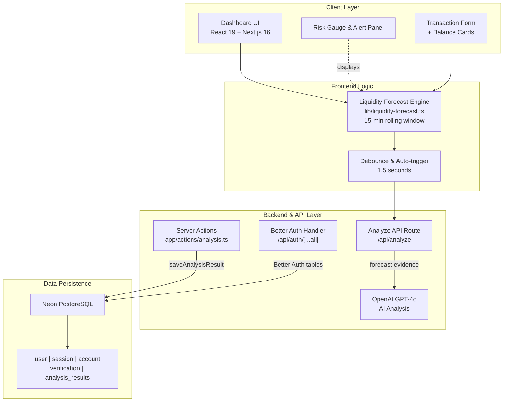
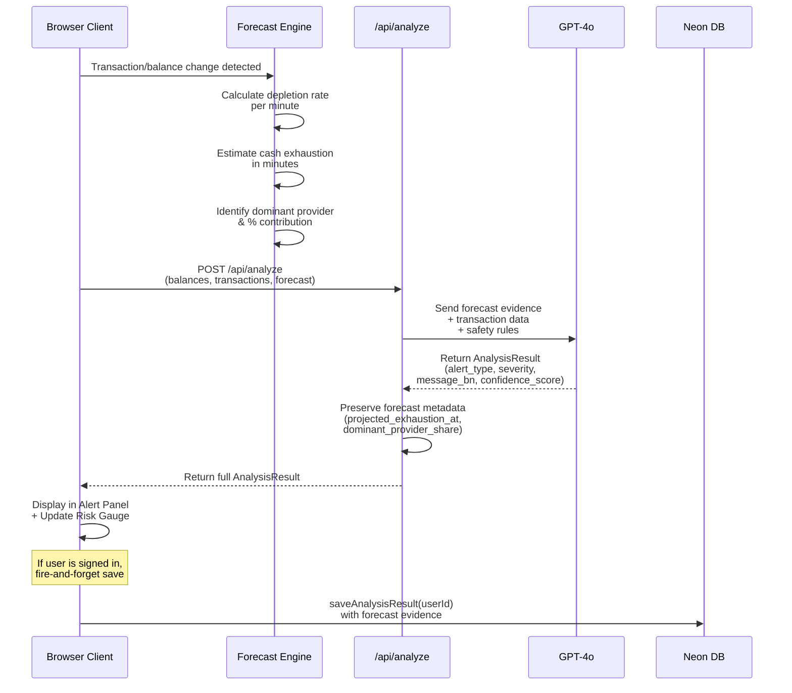
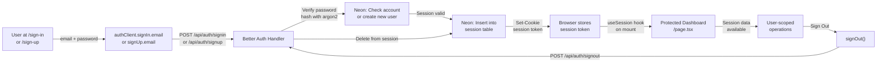
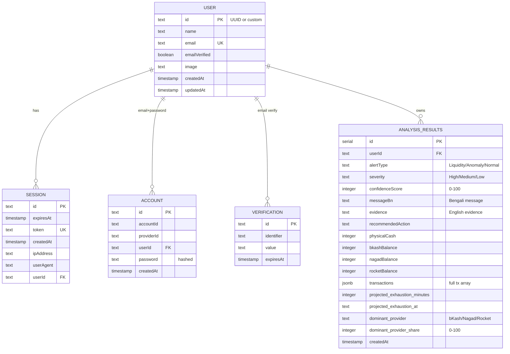

# ALRIP Architecture & System Design

---

## System Architecture Diagram



---

## Request Flow: Analyze Endpoint



---

## Authentication & Session Flow



---

## Data Model & ER Diagram



---

## Liquidity Forecast Algorithm

### Input
- **Current balances**: Physical Cash, bKash, Nagad, Rocket
- **Recent transactions**: Last 15 minutes of successful transactions with timestamps

### Processing

1. **Filter successful transactions** from the last 15 minutes (900 seconds)
   ```
   successful_txs = transactions.filter(
     tx => tx.status === 'Success' && 
           now - tx.timestamp <= 15 * 60 * 1000
   )
   ```

2. **Calculate per-provider cash drain**
   ```
   for each provider in [bKash, Nagad, Rocket]:
     provider_drain = sum of 'Cash Out' amounts from that provider
   ```

3. **Calculate depletion rate** (BDT per minute)
   ```
   total_drain = sum of all provider drains
   time_window_minutes = 15
   rate_per_minute = total_drain / time_window_minutes
   ```

4. **Project exhaustion time**
   ```
   if rate_per_minute > 0:
     minutes_to_exhaustion = physicalCash / rate_per_minute
     exhaustion_time = now + (minutes_to_exhaustion * 60 seconds)
   else:
     minutes_to_exhaustion = Infinity (no drain detected)
   ```

5. **Identify dominant provider**
   ```
   dominant_provider = provider with highest Cash Out amount
   dominant_share = (provider_drain / total_drain) * 100
   ```

6. **Determine severity**
   ```
   if minutes_to_exhaustion < 30:
     severity = "High"
   elif minutes_to_exhaustion < 60:
     severity = "Medium"
   else:
     severity = "Low"
   ```

### Output

```typescript
{
  alert_type: "Liquidity",
  severity: "High" | "Medium" | "Low",
  confidence_score: 90, // high confidence, deterministic calculation
  message_bn: "...", // from AI if available
  evidence: "...",
  recommended_action: "...",
  projected_exhaustion_minutes: 5,
  projected_exhaustion_at: "2024-01-01T12:35:00Z",
  dominant_provider: "bKash",
  dominant_provider_share: 85,
  forecast_rate_per_minute: 5000,
  source: "live_forecast"
}
```

---

## File Structure

```
liquidity-risk-analysis/
├── app/
│   ├── layout.tsx                    # Root layout with fonts & global theme
│   ├── page.tsx                      # Main dashboard (1000+ lines with all logic)
│   ├── globals.css                   # Tailwind v4, design tokens, dark theme
│   ├── api/
│   │   ├── analyze/
│   │   │   └── route.ts              # POST /api/analyze (OpenAI proxy)
│   │   └── auth/
│   │       └── [...all]/
│   │           └── route.ts          # Better Auth handler
│   ├── actions/
│   │   └── analysis.ts               # Server actions for DB persistence
│   ├── sign-in/
│   │   └── page.tsx                  # Sign-in page
│   └── sign-up/
│       └── page.tsx                  # Sign-up page
├── components/
│   ├── balance-cards.tsx             # Editable balance display
│   ├── transaction-form.tsx          # Add/edit/delete transactions
│   ├── transaction-table.tsx         # Transaction history table (if separate)
│   ├── risk-gauge.tsx                # SVG gauge chart
│   ├── alert-panel.tsx               # Alert display with forecast metrics
│   ├── history-drawer.tsx            # Browse past analyses
│   ├── api-key-modal.tsx             # (Removed, no longer needed)
│   └── auth-form.tsx                 # Shared sign-in/sign-up form
├── lib/
│   ├── types.ts                      # TypeScript interfaces
│   ├── auth.ts                       # Better Auth server config
│   ├── auth-client.ts                # Better Auth React client
│   ├── db/
│   │   ├── index.ts                  # Drizzle + Pool setup
│   │   └── schema.ts                 # Drizzle ORM table definitions
│   └── liquidity-forecast.ts         # Forecast engine (deterministic)
├── .env.example                      # Safe template for env vars
├── README.md                         # Project overview
├── ARCHITECTURE.md                   # This file
├── package.json                      # Dependencies
├── tsconfig.json                     # TypeScript config
├── next.config.js                    # Next.js config (Turbopack default)
└── tailwind.config.ts                # Tailwind v4 theme config
```

---

## Key Components

### Forecast Engine (`lib/liquidity-forecast.ts`)

- **Deterministic** — no randomness, reproducible results
- **Fast** — O(n) where n = number of transactions
- **Flexible** — accepts arbitrary time windows (default 15 minutes)
- **Severity-aware** — maps exhaustion time to High/Medium/Low severity

### API Route (`app/api/analyze/route.ts`)

- **Server-side API key** — `OPENAI_API_KEY` never exposed to client
- **Forecast evidence** — passes deterministic forecast to GPT-4o as context
- **Safety prompt** — enforces strict Bengali language rules
- **Metadata preservation** — keeps forecast output in response for UI display

### Server Actions (`app/actions/analysis.ts`)

- **User-scoped queries** — every operation includes `userId` filter
- **No RLS** — manual per-query scoping via `getUserId()` helper
- **Fire-and-forget** — saves don't block UI
- **Error handling** — gracefully handles DB/auth failures

### Dashboard (`app/page.tsx`)

- **Live forecast** — auto-updates every 1.5 seconds (debounced)
- **Transaction tracking** — automatic balance updates
- **History management** — localStorage fallback + Neon persistence
- **Session awareness** — displays user info, handles sign-out

---

## Deployment & Environment

### Vercel Deployment

- **Zero-config** — v0 defaults to Vercel
- **Auto-SSL** — HTTPS enforced
- **Edge functions** — API routes run on edge for low latency
- **Environment variables** — set via Vercel dashboard

### Neon Database

- **Serverless PostgreSQL** — auto-scales, always available
- **Automatic backups** — daily backups retained 7 days
- **Connection pooling** — PgBouncer enabled
- **RLS not used** — manual per-query scoping instead

---

## API Contracts

### POST /api/analyze

**Request:**
```typescript
{
  balances: {
    physicalCash: number,
    bkashBalance: number,
    nagadBalance: number,
    rocketBalance: number
  },
  transactions: Array<{
    provider: "bKash" | "Nagad" | "Rocket",
    type: "Cash Out" | "Cash In" | "Send Money",
    amount: number,
    status: "Success" | "Pending" | "Failed",
    timestamp?: number
  }>,
  forecast?: AnalysisResult  // optional, for context
}
```

**Response:**
```typescript
{
  alert_type: "Liquidity" | "Anomaly" | "Normal",
  severity: "High" | "Medium" | "Low",
  confidence_score: number,  // 0-100
  message_bn: string,        // Bengali explanation
  evidence: string,          // English rationale
  recommended_action: string,
  projected_exhaustion_minutes?: number,
  projected_exhaustion_at?: string,
  dominant_provider?: string,
  dominant_provider_share?: number,
  source: "live_forecast" | "ai_analysis"
}
```

### Server Actions

- `saveAnalysisResult(input, result)` — saves analysis + forecast to `analysis_results` table
- `getAnalysisHistory()` — retrieves user's past analyses from `analysis_results` table

---

## Performance Considerations

- **Forecast calculation** — O(n) per balance/transaction change, debounced 1.5s to avoid thrashing
- **API calls** — debounced; one call every 1.5s max
- **Database queries** — indexed on `userId` + `createdAt` for history retrieval
- **LocalStorage** — limited to 20 entries to avoid bloat
- **React re-renders** — memoized components prevent unnecessary updates

---

## Future Enhancements

- [ ] Multi-language support (Bengali + English UI options)
- [ ] Email alerts when high-severity forecast is triggered
- [ ] Webhook integrations for external monitoring systems
- [ ] Analytics dashboard (trending patterns, agent performance)
- [ ] API rate limiting per user
- [ ] Scheduled batch analyses for retrospective reports
- [ ] Mobile app for field officers

---

## Testing

- **Type-safety** — `pnpm tsc --noEmit` validates all TypeScript
- **Manual browser testing** — verify forecast + AI analysis in real time
- **Production simulation** — `pnpm build && pnpm start` locally

---

## Security Notes

1. **No localStorage for secrets** — only analysis history
2. **Server-side OpenAI key** — never in client bundles
3. **Better Auth sessions** — httpOnly cookies + CSRF protection
4. **SQL injection prevention** — Drizzle parameterized queries
5. **CORS headers** — API routes specify appropriate origins
6. **Rate limiting** — (future enhancement) limit requests per user

